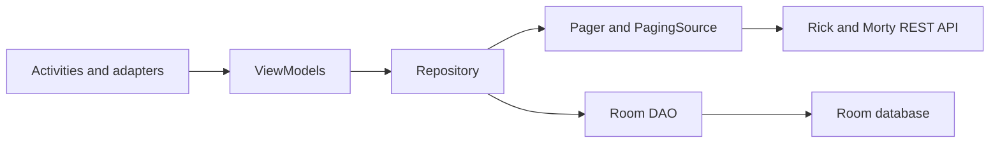

# Rick and Morty Android MVVM

An Android pet project for browsing, searching, filtering, and saving characters from the [Rick and Morty API](https://rickandmortyapi.com/).

This repository started as an early MVVM learning project and has since been refreshed in two focused areas:

- A production-shaped Paging 3 data flow with one filter state, one paging stream, lifecycle-aware collection, explicit load states, and tested page keys.
- Consistent edge-to-edge layouts with explicit status bar, navigation bar, display cutout, and keyboard inset handling.

It remains intentionally small and View-based, making it useful as a reference when migrating an older Android application without also introducing Compose or a broad build-system upgrade.

## Features

- Browse characters with paginated network loading.
- Search by character name.
- Filter results by male or female characters.
- Display initial loading, empty, refresh-error, append-loading, and append-error states.
- Retry failed initial and incremental loads.
- View character details.
- Save characters locally with Room.
- View saved characters and remove one with swipe-to-delete and undo.
- Delete all saved characters after confirmation.
- Store and display a local profile name with `SharedPreferences`.
- Open Rick and Morty web and YouTube pages or share the app through Android intents.
- Render consistently edge to edge across the intro, login, list, details, drawer, and saved-character screens.

## Architecture

The project uses a small MVVM-style structure with a shared repository for network and database operations.



```text
app/src/main/java/com/example/rickandmortymvvm/
├── core/           Shared utilities and UI helpers
├── data/
│   ├── api/        Retrofit service and PagingSource
│   └── db/         Room database and DAO
├── di/             Hilt providers and Application class
├── domain/
│   ├── model/      API and database models
│   └── repo/       Repository and Pager construction
└── presentation/
    ├── view/       Activities and RecyclerView adapters
    └── viewmodel/  Screen state and data-flow ownership
```

## Paging 3 reference flow

The character list is driven by a single `CharacterFilters` value containing the current search query and gender. That value is stored in `SavedStateHandle`, so it survives Activity recreation and process restoration.

```text
CharacterFilters StateFlow
        ↓
flatMapLatest — cancel the obsolete Pager when filters change
        ↓
Repository.searchCharacters()
        ↓
Pager.flow
        ↓
cachedIn(viewModelScope)
        ↓
repeatOnLifecycle(STARTED)
        ↓
PagingDataAdapter.submitData()
```

Important details demonstrated here:

- `flatMapLatest` guarantees that only the newest search/filter combination owns the list.
- `cachedIn(viewModelScope)` is applied after switching paging streams.
- The Activity has one PagingData collector instead of separate observers for each filter.
- `PagingDataAdapter` and `DiffUtil` own list updates; `notifyDataSetChanged()` is not used.
- `PagingSource` uses the API's `info.next` and `info.prev` metadata rather than guessing from item count.
- Refresh errors are rendered by the screen, while prepend and append errors are rendered by `LoadStateAdapter` instances.
- Opening Details or Saved does not destroy the list Activity, allowing the ViewModel cache and scroll state to remain available.

The Rick and Morty API returns HTTP 404 when a character filter has no matches. This project intentionally converts that API-specific response into an empty terminal page. Do not apply that rule generically in a production API client unless the service contract defines 404 as an empty search result.

## Edge-to-edge approach

Every Activity calls `enableEdgeToEdge()` and then applies insets to the view that owns each safe area:

- App-bar containers receive the status-bar and display-cutout top inset.
- RecyclerViews and detail content receive the navigation-bar bottom inset.
- Full-screen intro and login layouts receive all system-bar edges.
- The login screen also responds to IME insets so the keyboard does not cover its content.
- The navigation drawer handles its own safe-area padding.

The shared inset helper records the original XML padding before adding system insets. That prevents padding from accumulating when Android redispatches insets after rotation, keyboard changes, or navigation-mode changes.

## Technology

| Area | Implementation |
| --- | --- |
| Language | Kotlin |
| UI | XML layouts, View Binding, Material 3 |
| Architecture | MVVM-style Activities, ViewModels, repository |
| Pagination | Paging 3, `PagingSource`, `PagingDataAdapter`, load states |
| Async state | Coroutines, Flow, StateFlow, LiveData for saved characters |
| Networking | Retrofit, OkHttp, Gson |
| Persistence | Room, SharedPreferences |
| Dependency injection | Hilt |
| Images | Glide |
| Minimum Android version | API 21 |
| Compile / target SDK | 36 / 35 |
| Java toolchain | Java 17 |

## Getting started

### Requirements

- Android Studio with Android SDK 36 installed.
- JDK 17.
- An emulator or device running API 21 or newer.

The public character API does not require an API key.

### Clone and build

```bash
git clone git@github.com:GetRighhttt/RickAndMortyAndroidMVVM.git
cd RickAndMortyAndroidMVVM
./gradlew assembleDebug
```

Alternatively, open the repository in Android Studio, allow Gradle sync to finish, and run the `app` configuration.

## Tests

Run the local unit tests with:

```bash
./gradlew testDebugUnitTest
```

The focused PagingSource tests cover:

- Previous and next page keys.
- End-of-pagination behavior.
- Empty filter results.
- HTTP errors.
- Refresh-key recovery around the visible item.

To build and test together:

```bash
./gradlew testDebugUnitTest assembleDebug
```

## What to change for production

This repository demonstrates the Paging and inset patterns, but it is not a production template as-is. Before adopting the full project setup, consider the following:

- Use a `RemoteMediator` and a database-backed source of truth if paged content must work offline.
- Replace the local profile-name screen with real authentication if identity is required.
- Replace `fallbackToDestructiveMigration()` with explicit Room migrations.
- Disable BODY-level HTTP logging in release builds.
- Configure real release signing; this project currently uses debug signing for the release build type.
- Add instrumentation/UI tests for loading, retry, rotation, keyboard, cutout, gesture-navigation, and three-button-navigation behavior.
- Review and upgrade the Gradle, Kotlin, KSP, AndroidX, networking, and DI versions as a separate migration.
- Remove unused legacy dependencies and classes after confirming they are not needed by downstream experiments.

The current build still reports legacy plugin and deprecation warnings. Those are deliberately outside the Paging 3 and edge-to-edge work documented here.

## Demo videos

- [Character browsing, searching, saving, and deletion](https://github.com/GetRighhttt/RickAndMortyAndroidMVVM/assets/105057858/939ae1b9-07a6-43a7-8bcc-2da9239e070a)
- [Local profile name and saved-character persistence](https://github.com/GetRighhttt/RickAndMortyAndroidMVVM/assets/105057858/a19c935f-0326-484b-abe4-7ec156bab42d)
- [YouTube, website, and Android share intents](https://github.com/GetRighhttt/RickAndMortyAndroidMVVM/assets/105057858/e248d78f-b601-487b-963f-ebdcfc50e541)

The videos show earlier versions of the project, so small UI and behavior differences may exist.

## Contributing

For changes intended as reference material:

1. Keep the sample focused and explain non-obvious lifecycle or API-contract decisions.
2. Add or update tests for PagingSource keys, errors, and terminal-page behavior.
3. Run `./gradlew testDebugUnitTest assembleDebug`.
4. Open a pull request describing both the behavior change and the production lesson it demonstrates.

## Attribution

Character data and images are provided by the [Rick and Morty API](https://rickandmortyapi.com/). This is an unofficial learning project and is not affiliated with the API maintainers, Adult Swim, or the creators of Rick and Morty.

## Contact

Questions and comments: **stefanbusiness95@gmail.com**
